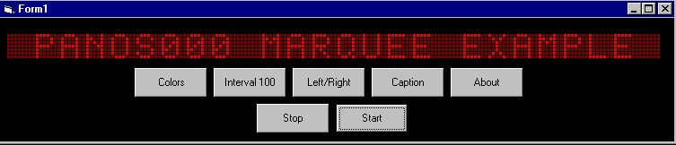



## Digital Cool Marquee which supports Greek language

### Description

although i am in mailing list of PSC for over a year, i decided to upload one my codes that i think could be useful for someone. it's a very cool digital marquee. it supports 5 different colors, scrolling direction, interval... pretty good for an application
 
### More Info
 
Just double click on Digital_Marquee.vbg adn run the programm

             |
---                |---
**Submitted On**   |2001-07-29 00:30:34
**By**             |[Panos000](https://github.com/Planet-Source-Code/PSCIndex/blob/master/ByAuthor/panos000.md)
**Level**          |Intermediate
**User Rating**    |5.0 (55 globes from 11 users)
**Compatibility**  |VB 5\.0, VB 6\.0
**Category**       |[Custom Controls/ Forms/  Menus](https://github.com/Planet-Source-Code/PSCIndex/blob/master/ByCategory/custom-controls-forms-menus__1-4.md)
**World**          |[Visual Basic](https://github.com/Planet-Source-Code/PSCIndex/blob/master/ByWorld/visual-basic.md)
**Archive File**   |[Digital Co236857282001\.zip](https://github.com/Planet-Source-Code/panos000-digital-cool-marquee-which-supports-greek-language__1-25611/archive/master.zip)

